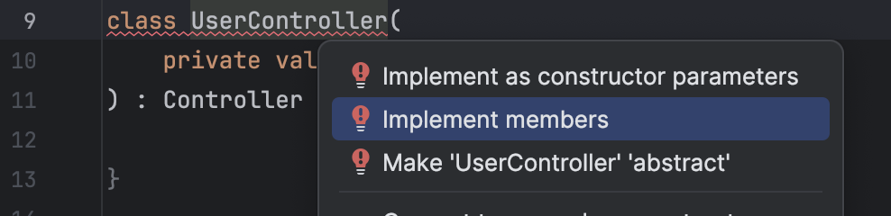
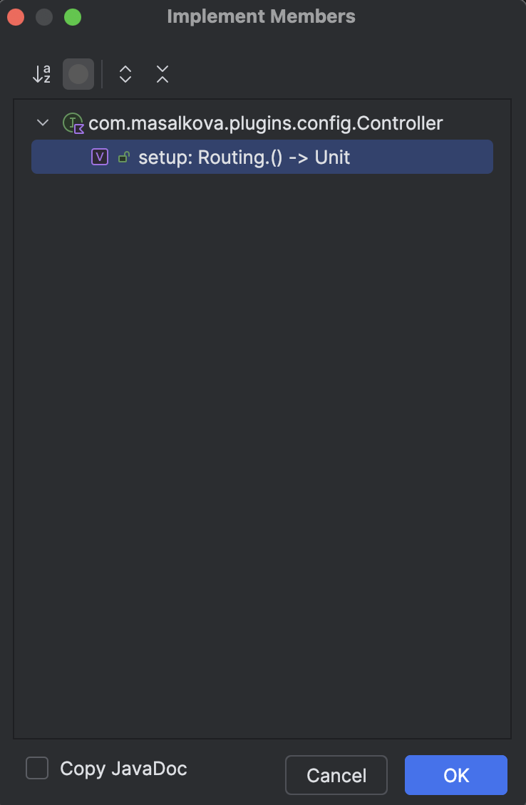

## Навигация: 
* Controller (Папка с контроллерами, это самый верхний уровень, в нем прописаны роутинги для пользователя)
* Service (Папка с сервисами, в них содержится бизнес логика)
* Repository (Папка с репозиториями, самый нижний уровень, в нем написаны запросы к БД)
* Dto (Папка с data классами, просто обертки над данными для удобства)
* Model (Папка с объектами БД)

## Уровень абстракции:

### Model -> Repository -> Service -> Controller (Модели используются только в репозиториях, репозиториии только в сервисах и тд)

# Примеры: 

## Model
```kotlin
object Users : LongIdTable() {
    val firstName = varchar("first_name", 255)
    val lastName = varchar("last_name", 255)
    val username = varchar("username", 1024)
    val password = varchar("password", 1024)
    val role = enumerationByName("role", 10, Role::class)
}

class UserDao(id: EntityID<Long>) : LongEntity(id) {
    companion object : LongEntityClass<UserDao>(Users)
    var firstName by Users.firstName
    var lastName by Users.lastName
    var username by Users.username
    var password by Users.password
    var role by Users.role

    fun toSerializable() = User(
        id.value,
        username,
        password,
        role
    )
}

data class User(
    val id: Long,
    val username: String,
    val password: String,
    val role: Role
)
```

## Repository
```kotlin
interface UserRepository {

    fun findAll(): List<User>

    fun findByUsername(username: String): User?

    fun findById(id: Long): User?

    fun existsByUsername(username: String): Boolean

    fun save(registrationRequest: RegistrationRequest): User
}


class UserRepositoryImpl : UserRepository {

    override fun findAll(): List<User> = dbQuery {
        UserDao.all()
            .map { it.toSerializable() }
    }

    override fun findByUsername(username: String) = dbQuery {
        UserDao.find { Users.username eq username }
            .firstOrNull()
            ?.toSerializable()
    }

    override fun findById(id: Long) = dbQuery {
        UserDao.findById(id)
            ?.toSerializable()
    }

    override fun existsByUsername(username: String) = dbQuery {
        UserDao.find { Users.username eq username }
            .any()
    }

    override fun save(registrationRequest: RegistrationRequest)= dbQuery {
        UserDao.new {
            firstName = registrationRequest.firstName
            lastName = registrationRequest.lastName
            username = registrationRequest.username
            password = BCrypt.hashpw(registrationRequest.password, BCrypt.gensalt())
            role = Role.USER
        }.toSerializable()
    }
}
```

### При создании репозитория нужно прописать его в файл Kodein.kt:
```kotlin
internal val repositories = DI.Module("repositories") {
    bind<UserRepository>() with singleton { UserRepositoryImpl() }
}
```

## Service
```kotlin
interface UserService {

    fun findAll(): List<User>

    fun findById(id: Long): User
}

class UserServiceImpl(
    private val userRepository: UserRepository
) : UserService {

    override fun findAll(): List<User> {
        return userRepository.findAll()
    }

    override fun findById(id: Long): User {
        return userRepository.findById(id)
            ?: throw NotFoundException("User with id $id not found")
    }
}
```

### При создании сервиса нужно прописать его в файл Kodein.kt:
```kotlin
internal val services = DI.Module("services") {
    bind<UserService>() with singleton { UserServiceImpl(instance()) }
}

```

## Controller
```kotlin
class UserController(
    private val userService: UserService
) : Controller {
    
}
```
### Нажать ctrl + enter на "UserController" (там будет подчекнуто красным)




```kotlin
class UserController(
    private val userService: UserService
) : Controller {
    override val setup: Routing.() -> Unit
        get() = {
            
        }
}
```

```kotlin
class UserController(
    private val userService: UserService
) : Controller {
    override val setup: Routing.() -> Unit
        get() = {

            route("users") {

                get {
                    val ans = userService.findAll()
                    call.respond(ans)
                }

                get("{id}") {
                    val id = call.parameters.getOrFail<Long>("id")
                    val ans = userService.findById(id)
                    call.respond(ans)
                }

            }

        }
}
```

### При создании контроллера нужно прописать его в файл Kodein.kt:
```kotlin
internal val controllers = DI.Module("controllers") {
    bindSet<Controller> {
        bind { singleton { UserController(instance()) } }
    }
}
```

# Kodein:
## С помощью кодеина создаем экземпляры классов, в скобочках к объекту передаем нужные ему параметры в конструктор с помощью instance():
```kotlin
internal val services = DI.Module("services") {
    bind<UserService>() with singleton { UserServiceImpl(instance()) }
}

class UserServiceImpl(
    private val userRepository: UserRepository
) 
```
## Кол-во instance() = кол-ву параметров в классе
